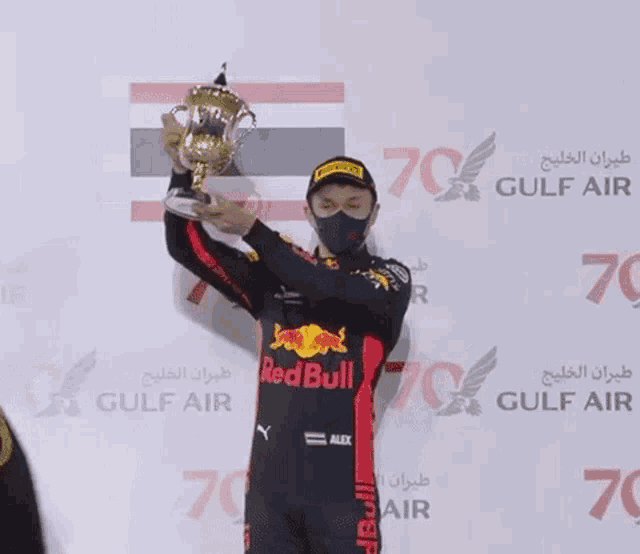

  

 

    
 

  

 
  
 
<h3> </h3>──────ˋˏ ༻𖤓༺ ˎˊ────── <h3>
    
 
 <h4> ˗ˏˋ ˗ᴄ+ʜ ꜰʀᴇᴇʟʏ ᴜɴʟᴇꜱꜱ ꜰʀɪᴇɴᴅꜱ ᴀʀᴏᴜɴᴅ/ꜱᴛᴀᴛᴇꜱ ᴏᴛʜᴇʀᴡɪꜱᴇ!˗ ˎˊ˗<h4>
<h6>"𝙸 𝚍𝚒𝚍𝚗'𝚝 𝚠𝚊𝚗𝚝 𝚝𝚘 𝚋𝚎 𝚝𝚑𝚊𝚝 𝚐𝚞𝚢. 𝚃𝚑𝚎 𝚘𝚗𝚎 𝚠𝚑𝚘 𝚢𝚘𝚞 𝚏𝚘𝚛𝚐𝚘𝚝 𝚊𝚋𝚘𝚞𝚝.” </h6>

  

  <!--
**AlbonO23/AlbonO23** is a ✨ _special_ ✨ repository because its `README.md` (this file) appears on your GitHub profile.

Here are some ideas to get you started:

- 🔭 I’m currently working on ...
- 🌱 I’m currently learning ...
- 👯 I’m looking to collaborate on ...
- 🤔 I’m looking for help with ...
- 💬 Ask me about ...
- 📫 How to reach me: ...
- 😄 Pronouns: ...
- ⚡ Fun fact: ...
-->
